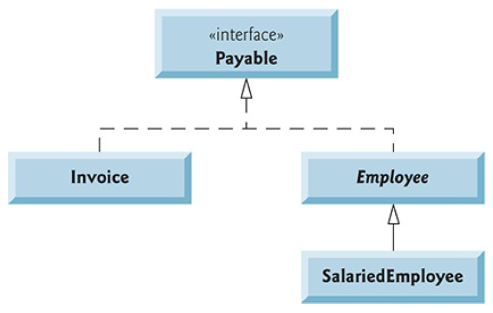

# Example2: Polymorphism-Interfaces-Abstraction

Create interface for Employee and Invoice that is called Payable with method getPaymentAmount
Design classes for Invoice and Employee that uses the Payable interface. Test Payable interface by creating objects of Invoice and SalariedEmployee in PayableInterfaceTest (Main)

